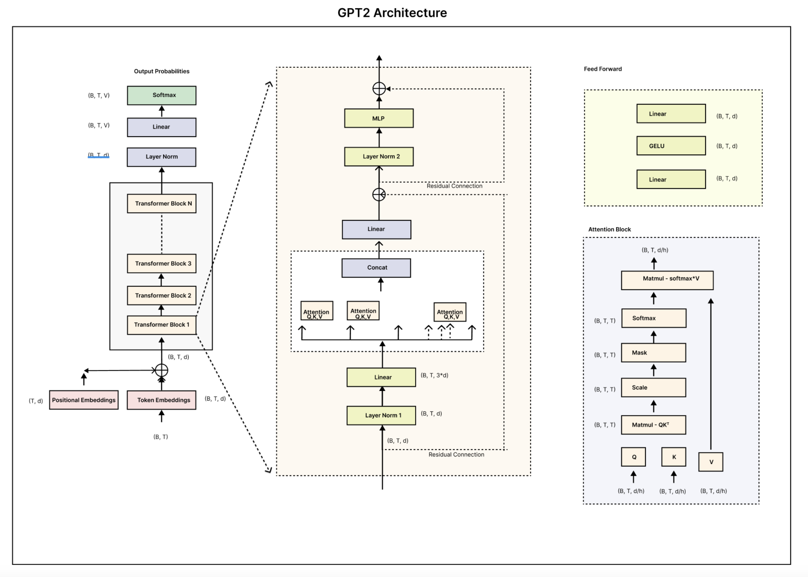

# GPT Model

## Overview

This document provides a detailed description of a GPT-like model architecture, including each layer, its inputs and outputs, and key variables. The model is designed for natural language processing tasks such as text generation, summarization, and translation.

## GPT2 Architecture implemented

## Content
1. [Architecture Overview](#architecture-overview)
2. [Model Components](#model-components)
   - [Input Layer](#input-layer)
   - [Embedding Layer](#embedding-layer)
   - [Positional Encoding](#positional-encoding)
   - [Transformer Blocks](#transformer-blocks)
     - [Multi-Head Self-Attention](#multi-head-self-attention)
     - [Feed Forward Network](#feed-forward-network)
     - [Layer Normalization](#layer-normalization)
   - [Output Layer](#output-layer)
3. [Training](#training)
4. [Hyperparameters](#hyperparameters)

## Architecture Overview

The GPT-like model consists of:

- **Preprocessing:**
  - **Tokenization**: The process of converting raw text into tokens that can be processed by the model. This includes breaking down sentences into words or subwords and mapping them to unique IDs.
  - **Token Embedding**: Converts token IDs into dense vectors of fixed dimensions, representing the semantic features of each token.
  - **Positional Embedding**: Adds information about the position of each token in the sequence to help the model understand token order.

- **Transformer Block**: Each transformer block comprises several layers, including:
  - **Multi-Head Attention**: Allows the model to focus on different parts of the input sequence simultaneously, capturing relationships between tokens.
  - **Layer Normalization**: Stabilizes the learning process by normalizing the outputs of each layer.
  - **Feed Forward Network**: Applies transformations to the embeddings to introduce non-linearity.
  - **Dropout**: Regularization technique to prevent overfitting by randomly setting a fraction of input units to zero during training.
  - **Shortcut Connection / Skip Connection**: Allows gradients to flow through the network more easily by providing alternate paths for gradient propagation.

## Model Components

### Input Layer

- **Input**: Token IDs
- **Output**: Sequence of token IDs
- **Description**: The input layer accepts tokenized text data represented as integer IDs.

### Embedding Layer

- **Input**: Token IDs
- **Output**: Token embeddings (shape: `[batch_size, sequence_length, embedding_dimension]`)
- **Variables**:
  - `embedding_matrix`: A learnable matrix of shape `[vocab_size, embedding_dimension]`
- **Description**: Converts token IDs into dense vectors of fixed dimensions that represent the semantic features of each token.

### Positional Encoding

- **Input**: Sequence length
- **Output**: Positional embeddings (shape: `[1, sequence_length, embedding_dimension]`)
- **Description**: Adds positional information to the embeddings to help the model understand the order of tokens in the sequence. This can be achieved using sine and cosine functions.

### Transformer Blocks

Each transformer block consists of several components:

#### Multi-Head Self-Attention

- **Input**: Token embeddings and positional encodings
- **Output**: Contextualized token embeddings (shape: `[batch_size, sequence_length, embedding_dimension]`)
- **Variables**:
  - `Q`: Query matrix
  - `K`: Key matrix
  - `V`: Value matrix
  - `attention_scores`: Attention weights calculated using softmax
  - `context_weights`: The weighted sum of value vectors, representing the context for each token
- **Description**: Computes attention scores to weigh the relevance of each token in the context of others, allowing the model to capture long-range dependencies. The context weights are calculated by multiplying the attention scores with the value matrix, yielding a weighted representation of the input tokens.

#### Feed Forward Network

- **Input**: Output from the self-attention layer
- **Output**: Processed embeddings (shape: `[batch_size, sequence_length, embedding_dimension]`)
- **Description**: Applies two linear transformations with a non-linear activation function (usually GELU) to introduce more complexity to the model.

#### Layer Normalization

- **Input**: Output from the feed-forward network
- **Output**: Normalized embeddings (shape: `[batch_size, sequence_length, embedding_dimension]`)
- **Description**: Normalizes the output of each sub-layer to stabilize and accelerate training.

### Dropout

- **Input**: Output from the previous layer (usually the feed-forward network)
- **Output**: Regularized output (shape: `[batch_size, sequence_length, embedding_dimension]`)
- **Description**: A regularization technique that randomly sets a fraction of input units to zero during training, helping prevent overfitting.

### Skip Connection

- **Input**: Output from the feed-forward network and the input to the transformer block
- **Output**: Combined output (shape: `[batch_size, sequence_length, embedding_dimension]`)
- **Description**: Adds the input of the transformer block to the output of the feed-forward network, allowing gradients to flow more easily during backpropagation.

### Output Layer

- **Input**: Final contextualized embeddings from the last transformer block
- **Output**: Logits for the vocabulary (shape: `[batch_size, sequence_length, vocab_size]`)
- **Description**: Projects the final embeddings back to the vocabulary space to predict the next token in the sequence.

## Training

- **Objective**: The model is trained using a language modeling objective, typically maximizing the likelihood of the next token given the previous tokens.
- **Loss Function**: Cross-entropy loss is used to measure the difference between predicted probabilities and actual token distributions.
- **Optimizer**: Common optimizers include Adam or AdamW.

## Hyperparameters

- `vocab_size`: Size of the vocabulary
- `embedding_dimension`: Dimensionality of the embedding vectors
- `num_layers`: Number of transformer blocks
- `num_heads`: Number of attention heads in the multi-head self-attention layer
- `dropout_rate`: Dropout rate for regularization
- `learning_rate`: Learning rate for the optimizer

[def]: 'gpt2_architecture.png'